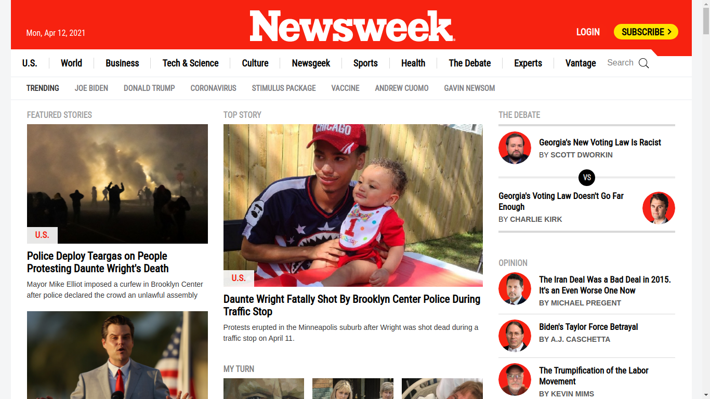

# Using Bootstrap

Clone of Newsweek homepage

## Build With

- HTML
- CSS
- Bootstrap

## Live Demo

[Using Bootstrap](https://igorlimamendes.github.io/using-bootstrap/)

## Getting Started

The following will be instructions on how you can see the project on your own computer.

### Prerequisites
Linux, macOS, Windows or similar.\
Chrome, Firefox, Safari, Opera or similar.

### Setup
Download or clone the git repository.

### Usage
Run the index.html file.

## Author

**Igor Lima Mendes**

- GitHub: [@igorlimamendes](https://github.com/igorlimamendes)
- LinkedIn: [Igor Lima Mendes](https://linkedin.com/in/igorlimamendes)

## Contributing

Contributions, issues, and feature requests are welcome on the [issues page](https://github.com/igorlimamendes/using-bootstrap/issues).

## License

This project is under [MIT](https://opensource.org/licenses/MIT) license.
